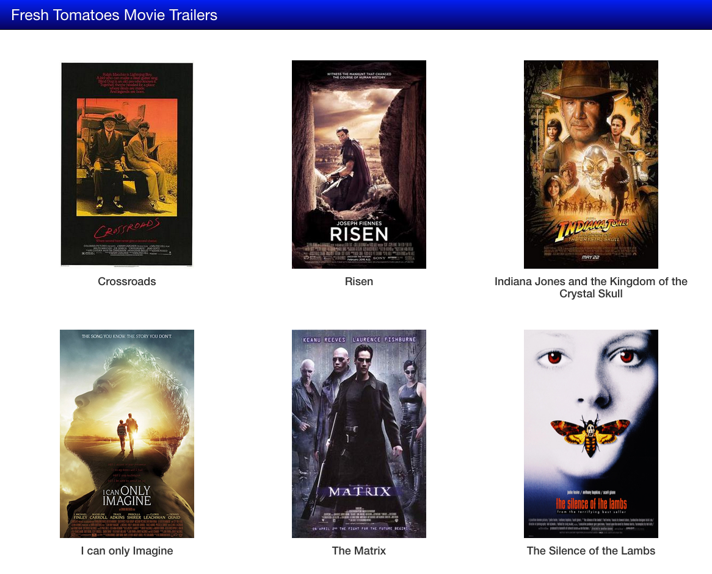

## Fresh Tomatoes Movie Trailers
The "Fresh Tomatoes Movie Trailers" is a static web page that present to you some of my favourite movies.

#####Pre-requisites
You will need to have Python installed on your PC to be able to generate the page
#####Create Page
To generate and open the web page you must do the following:
1. Open a terminal Window
2. Navigate to the directory where the files are located
3. Type in the following command and hit enter:
   `python entertainment_center.py`
4. The web page should open in your default browser
#####Usage
For each movie you will see its poster and title. If you hold your mouse pointer over the poster you will see a brief summary of the movie.
If you want to see the movie trailer just click the poster. It's as simple as that! Enjoy!
#####Screenshot
